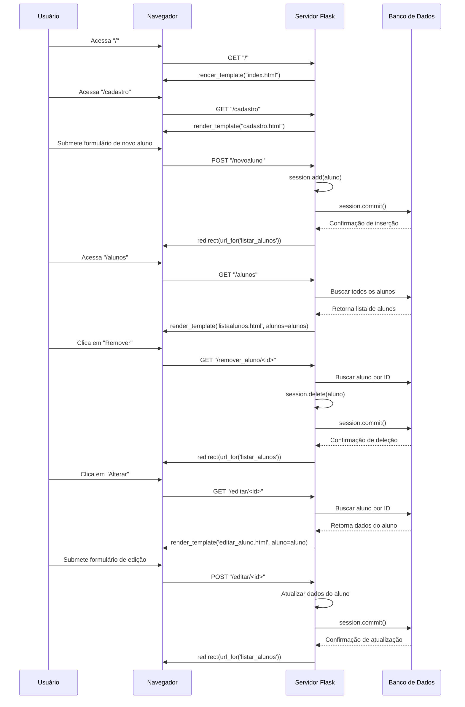

# Projeto Diario

Projeto Diario é uma aplicação desenvolvida no Senai Taguatinga utilizando Python e Flask. O objetivo do projeto é permitir a adição de estudantes a um banco de dados e possibilitar que cada estudante crie diários de bordo para registrar suas aulas, que também são armazenados no banco de dados.

## Funcionalidades

- Adicionar estudantes ao banco de dados.
- Criar e armazenar diários de bordo para as aulas.
- Interface simples para entrada de dados.

## Tecnologias Utilizadas

- **Python**: Linguagem principal do projeto.
- **Flask**: Framework utilizado para o desenvolvimento da aplicação web.
- **MySQL**: Banco de dados para armazenamento dos estudantes e diários de bordo.
- **SQLAlchemy**: Toolkit SQL para interagir com o banco de dados MySQL.
- **HTML/CSS**: Interface básica para interação com o usuário.

## Instalação

1. Clone o repositório:
    ```bash
    git clone https://github.com/henriqueserafin/projeto-diario.git
    ```

2. Navegue até o diretório do projeto:
    ```bash
    cd projeto-diario
    ```

3. Crie um ambiente virtual e ative-o:
    ```bash
    python -m venv venv
    venv\Scripts\activate
    ```

4. Instale as dependências:
    ```bash
    pip install -r requirements.txt
    ```

5. Configure o banco de dados MySQL com as credenciais adequadas no arquivo principal do projeto.

6. Execute a aplicação:
    ```bash
    python app.py
    ```

## Uso

1. Acesse a aplicação via navegador em `http://127.0.0.1:5001/`.
2. Na página principal, você pode entrar como um aluno já cadastrado ou se cadastrar no banco de dados.
3. Na página de adicionar um novo diário de bordo você prenche a caixa de texto utilizando o formulário disponível e seleciona enviar.
4. As entradas são salvas automaticamente no banco de dados.

## Estrutura do Projeto

- `app.py`: Arquivo principal da aplicação Flask.
- `templates/`: Diretório que contém os arquivos HTML.
- `static/`: Diretório para arquivos estáticos como CSS.

# Diagrama de Sequência




## Contribuição

Contribuições são bem-vindas! Sinta-se à vontade para enviar pull requests ou abrir issues para discussão.

## Licença

Este projeto está licenciado sob a [Apache License](LICENSE).
